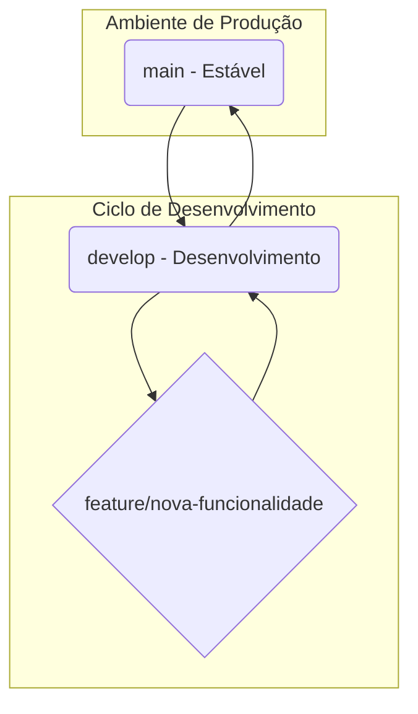

# Tutorial de Versionamento Git para o Projeto Robô SLAM

Este documento descreve o fluxo de trabalho (workflow) Git para o desenvolvimento organizado e seguro do projeto. O objetivo é garantir que tenhamos sempre uma versão estável e funcional (`main`), enquanto o desenvolvimento de novas funcionalidades acontece de forma isolada e segura (`develop` e `feature branches`).

---

## As Branches Principais

Nosso projeto é gerenciado por duas branches permanentes:

1.  **`main`**: Esta é a branch "de ouro". Ela contém **apenas** código que foi testado e confirmado que funciona no robô. A `main` está sempre pronta para ser executada no ambiente de produção (a Raspberry Pi).
2.  **`develop`**: Esta é a branch de integração. Todas as novas funcionalidades são mescladas aqui para testes combinados. A `develop` reflete o estado mais recente do desenvolvimento e pode ficar instável temporariamente.

### O Fluxo Visual



---

## A Regra de Ouro

> **Nunca faça commits diretamente nas branches `main` ou `develop`!** Todo novo trabalho deve ser feito em uma "feature branch" temporária.

---

## O Ciclo de Vida de uma Nova Funcionalidade

Este é o processo completo para adicionar qualquer nova funcionalidade ou correção no robô.

### Etapa 1: Iniciar uma Nova Tarefa

Antes de começar a codificar, crie uma branch específica para sua tarefa a partir da `develop`.

1.  **Sincronize sua `develop` local (no Desktop):**
    ```bash
    git checkout develop
    git pull origin develop
    ```

2.  **Crie a "feature branch":**
    Use um nome descritivo. Por exemplo, se for melhorar o desvio de obstáculos:
    ```bash
    git checkout -b feature/melhorar-desvio-obstaculos
    ```
    Agora você está em um ambiente seguro e isolado para trabalhar.

### Etapa 2: O Ciclo de "Codificar e Testar"

Este é o processo que você repetirá várias vezes até a funcionalidade ficar perfeita.

1.  **Codifique no Desktop:** Faça as alterações no código no seu ambiente de desenvolvimento principal.

2.  **Salve e envie sua alteração (do Desktop):**
    ```bash
    git add .
    git commit -m "feat: adiciona sensor de proximidade frontal"
    git push origin feature/melhorar-desvio-obstaculos
    ```
    *(A flag `-u` na primeira vez cria o link entre a branch local e a remota)*

3.  **Baixe e teste na Raspberry Pi:**
    ```bash
    # Na Raspberry Pi, mude para a branch (só na primeira vez)
    git checkout feature/melhorar-desvio-obstaculos

    # Puxe as últimas alterações
    git pull origin feature/melhorar-desvio-obstaculos

    # Teste no robô real
    python src/main.py
    ```

4.  **Repita:** O teste não foi como o esperado? Volte para o passo 1 no desktop, codifique, salve, envie e teste novamente na Pi.

### Etapa 3: Finalizar a Tarefa

Sua funcionalidade está pronta e aprovada nos testes. É hora de incorporá-la na `develop`.

1.  **Volte para a `develop` (no Desktop):**
    ```bash
    git checkout develop
    ```

2.  **Incorpore a sua feature branch:**
    ```bash
    git merge feature/melhorar-desvio-obstaculos
    ```

3.  **Envie a `develop` atualizada:**
    ```bash
    git push origin develop
    ```
    Neste ponto, a funcionalidade já faz parte da linha de desenvolvimento principal.

### Etapa 4: Lançar uma Nova Versão Estável

Você só faz isso quando a `develop` atingiu um novo marco de estabilidade e você quer que essa versão se torne a nova `main`.

1.  **Vá para a `main` (no Desktop):**
    ```bash
    git checkout main
    git pull origin main
    ```

2.  **Incorpore todo o progresso da `develop`:**
    ```bash
    git merge develop
    ```

3.  **Envie a nova `main` para o repositório:**
    ```bash
    git push origin main
    ```

4.  **(Recomendado) Crie uma Tag:** Marque esta versão com um número para referência futura.
    ```bash
    git tag -a v1.36 -m "Versão com desvio de obstáculos aprimorado"
    git push origin v1.36
    ```

5.  **Atualize a Raspberry Pi para a nova versão estável:**
    ```bash
    # Na Raspberry Pi
    git checkout main
    git pull origin main
    ```
---

Este fluxo de trabalho garante que o projeto evolua de forma organizada, segura e rastreável.
