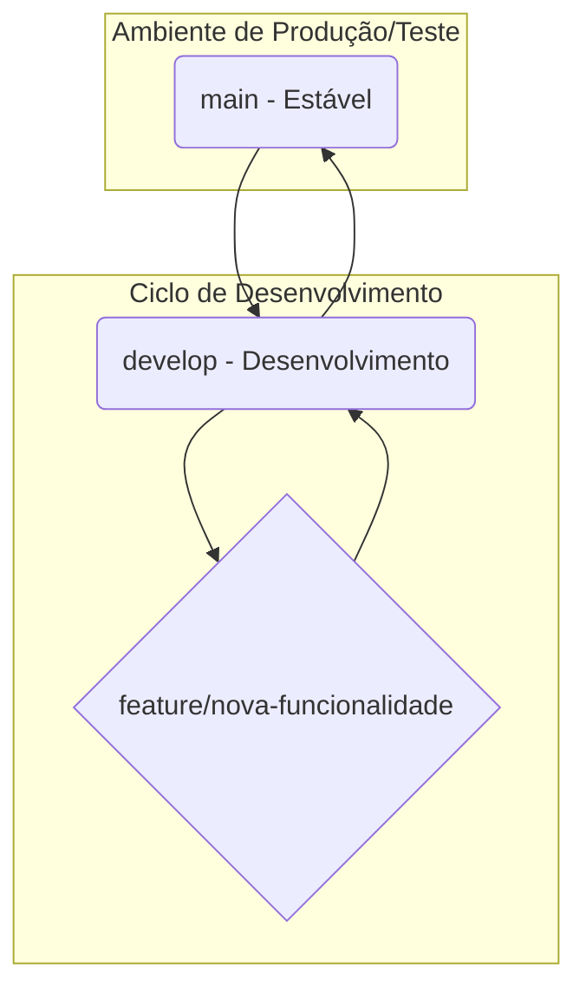

# Tutorial de Versionamento Git para o Projeto Robô SLAM

Este documento descreve o fluxo de trabalho (workflow) Git para o desenvolvimento organizado e seguro do projeto. O objetivo é garantir que tenhamos sempre uma versão estável e funcional (`main`), enquanto o desenvolvimento de novas funcionalidades acontece de forma isolada e segura.

---

## Filosofia e Papéis dos Ambientes

-   **Desktop**: Seu ambiente principal de **codificação**. É rápido, confortável e onde a maior parte do código é escrita.
-   **Raspberry Pi**: Seu ambiente de **teste físico**. É aqui que o código é validado no hardware real. A Pi não fica "travada" em uma única branch; ela **visita** a branch que precisa ser testada.

## As Branches Principais

1.  **`main`**: A branch "de ouro". Contém **apenas** código que foi extensivamente testado e considerado uma **versão oficial e estável**. Pense nela como o "porto seguro" da Raspberry Pi, a versão para a qual você pode voltar se algum teste der muito errado.
2.  **`develop`**: A branch de integração. Reflete o estado mais recente do desenvolvimento. Novas funcionalidades, depois de testadas e validadas em suas próprias branches, são mescladas aqui.

### O Fluxo Visual



---

## A Regra de Ouro

> **Nunca faça commits diretamente nas branches `main` ou `develop`!** Todo novo trabalho deve ser feito em uma "feature branch" temporária.

---

## O Ciclo de Vida de uma Nova Funcionalidade (Fluxo Prático)

Este é o processo completo para adicionar qualquer nova funcionalidade ou correção no robô.

### Etapa 1: Iniciar uma Nova Tarefa

Sempre comece uma nova tarefa criando uma branch específica a partir da `develop`.

1.  **Sincronize sua `develop` local (no Desktop):**
    ```bash
    git checkout develop
    git pull origin develop
    ```

2.  **Crie a "feature branch":**
    Use um nome descritivo. Ex: `feature/melhorar-curvas`.
    ```bash
    git checkout -b feature/melhorar-curvas
    ```
    Agora você está em um ambiente seguro e isolado para trabalhar no seu desktop.

### Etapa 2: O Ciclo de "Codificar -> Enviar -> Testar"

Este é o processo que você repetirá várias vezes até a funcionalidade ficar perfeita.

1.  **Codifique no Desktop:** Faça as alterações no código.

2.  **Envie sua alteração para o GitHub (do Desktop):**
    ```bash
    git add .
    git commit -m "feat: ajusta parâmetro de aceleração"
    git push origin feature/melhorar-curvas
    ```

3.  **Mude para a branch de teste na Raspberry Pi:**
    É aqui que a validação acontece. Você vai "visitar" a branch da sua nova funcionalidade com a Pi.
    ```bash
    # Na Raspberry Pi, mude para a branch (só na primeira vez)
    git checkout feature/melhorar-curvas

    # Puxe as últimas alterações que você enviou do desktop
    git pull origin feature/melhorar-curvas
    ```

4.  **Teste no Robô Real:**
    ```bash
    # Na Raspberry Pi, dentro da branch da feature
    python src/main.py
    ```

5.  **Repita:** O teste não foi como o esperado? Volte para o passo 1 (codificar no desktop), salve, envie (passo 2) e puxe para testar novamente na Pi (passos 3 e 4).

### Etapa 3: Finalizar e Integrar a Funcionalidade

Sua funcionalidade foi validada nos testes físicos e está funcionando perfeitamente na branch `feature/melhorar-curvas`. Agora, vamos incorporá-la oficialmente na `develop`.

1.  **Volte para a `develop` (no Desktop):**
    ```bash
    git checkout develop
    ```

2.  **Incorpore a sua feature branch:**
    ```bash
    git merge feature/melhorar-curvas
    ```

3.  **Envie a `develop` atualizada:**
    ```bash
    git push origin develop
    ```
    Neste ponto, a funcionalidade já faz parte da linha de desenvolvimento principal.

### Etapa 4: Lançar uma Nova Versão Estável

Você só faz isso quando a `develop` atingiu um novo marco de estabilidade e você quer que essa versão se torne a nova `main`.

1.  **Vá para a `main` (no Desktop):**
    ```bash
    git checkout main
    git pull origin main
    ```

2.  **Incorpore todo o progresso da `develop`:**
    ```bash
    git merge develop
    ```

3.  **Envie a nova `main` para o repositório:**
    ```bash
    git push origin main
    ```

4.  **(Recomendado) Crie uma Tag:** Marque esta versão com um número.
    ```bash
    git tag -a v1.36 -m "Versão com curvas aprimoradas"
    git push origin v1.36
    ```

5.  **Atualize a Raspberry Pi para a nova versão estável (Porto Seguro):**
    ```bash
    # Na Raspberry Pi
    git checkout main
    git pull origin main
    ```

---

Este fluxo de trabalho garante que o projeto evolua de forma organizada, segura e, mais importante, **testada no hardware real** antes de ser considerado estável.
